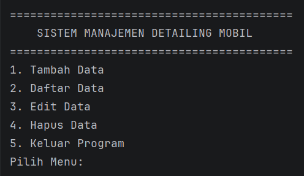
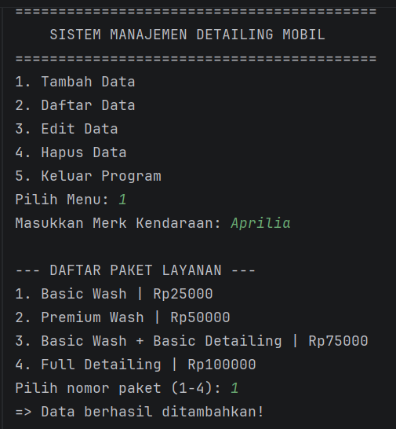
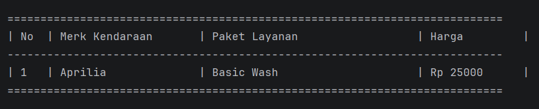
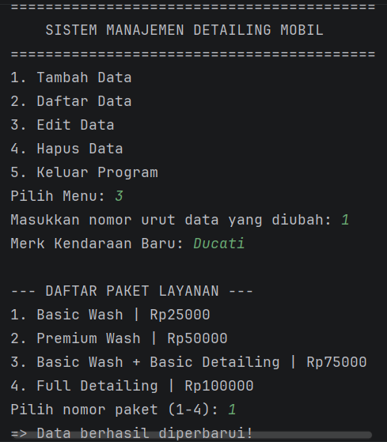
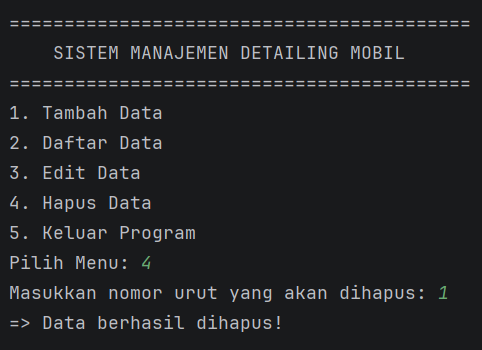
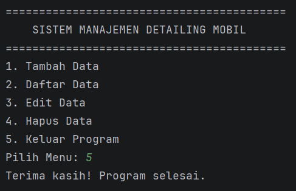

#  LAPORAN POSTTEST 1 - Detailing Kendaraan

## 1. Identitas 
* **Nama** : Devon Falen Pasae
* **NIM** : 2409106055
* **Sistem** : Sistem Manajemen Detailing Kendaraan

---

## 2. Detail Program
Sistem ini dikembangkan sebagai program berbasis Java yang dibuat untuk mengelola operasional pada usaha jasa perawatan/detailing kendaraan. Fokus pembuatan difokuskan pada penerapan siklus data **CRUD (Create, Read, Update, dan Delete)** secara interaktif melalui input pengguna.

Secara teknis, program ini mengadopsi prinsip Pemrograman Berorientasi Objek (OOP), di mana setiap aktivitas detailing diproses sebagai entitas mandiri melalui class Detailing. Untuk menjaga fleksibilitas penyimpanan, digunakan struktur __ArrayList__ yang memungkinkan basis data berkembang sesuai dengan jumlah transaksi yang diinput oleh pengguna.

---

## 3. Fitur Program
1. **Tambah Data / Create**: Menambahkan data transaksi.
2. **Daftar Data / Read**: Menampilkan data transaksi dengan format tabel.
3. **Edit Data / Update**: Mengubah detail transaksi.
4. **Hapus Data / Delete**: Menghapus data transaksi individual.

---

## 4. Output Program

- **Menu Utama**


- **Menu Tambah Data**


- **Menu Daftar Data**


- **Menu Edit Data**


- **Menu Hapus Data**


- **Opsi Keluar Program**


---

## 5. Dokumentasi Kode

- **Import & Deklarasi Class**
```java
import java.util.ArrayList;
import java.util.Scanner;
```
